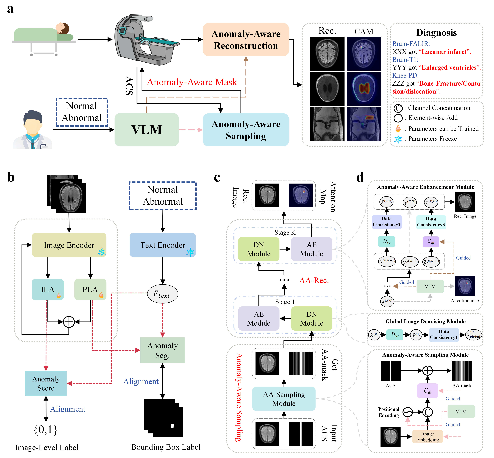

# PASS: Personalized, Anomaly-aware Sampling and reconStruction for Fast MRI

## 🔍 Description

**PASS (Personalized, Anomaly-aware Sampling and reconStruction)** is an intelligent and **personalized** framework for **accelerated Magnetic Resonance Imaging (MRI)**. It addresses the critical limitation of traditional fast MRI methods—their lack of adaptability to patient-specific pathologies—by leveraging a **Vision-Language Model (VLM)** to guide the entire imaging pipeline.

PASS establishes a **closed-loop system** for fast MRI that achieves:

* **Personalized Acquisition:** An **Anomaly-aware Sampling Module** dynamically generates patient-specific k-space trajectories
* **Task-Oriented Reconstruction:** A physics-informed **Deep Unrolling Network** is guided by an anomaly-aware prior extracted from a VLM (fine-tuned **NetAD**) to selectively enhance pathological features.
* **Superior Clinical Utility:** It achieves superior image quality, especially within lesion regions, and directly translates to improvements in downstream diagnostic tasks, such as **fine-grained anomaly detection** and **diagnosis**.

Evaluated on the **fastMRI benchmark** (Brain T1w, FLAIR, and Knee PD) augmented with **fastMRI+** anomaly labels, PASS demonstrates robust performance across diverse anatomies, contrasts, and acceleration factors ($4\times$ and $8\times$).

---

## 🧭 Framework Overview

Overview of the **PASS** closed-loop pipeline for personalized, fast MRI. The Vision-Language Model (VLM) guides both the anomaly-aware sampling and the deep unrolling reconstruction to prioritize clinically relevant features. 

---

## 🗂 Step 1. Data Preparation

### 🔹 fastMRI and fastMRI+ Datasets

The PASS framework is trained and evaluated using publicly available datasets:

* **Multi-coil Brain and Knee MRI Data:** Sourced from the **fastMRI dataset** ([https://fastmri.org/](https://fastmri.org/)).
* **Pathological Annotations:** Sourced from the **fastMRI+ dataset** ([https://github.com/microsoft/fastmri-plus](https://github.com/microsoft/fastmri-plus)), which provides lesion types and bounding box coordinates.

### 🔹 Preprocessing Pipeline

The following steps were used for data preparation:

1.  **Coil Sensitivity Maps:** Estimated using the **ESPIRIT algorithm**.
2.  **Brain Scan Standardization:** T1-weighted (T1w) and FLAIR contrasts. Raw k-space data were transformed to the image domain, uniformly **cropped to $320 \times 320$ pixels**, and corresponding k-space and coil sensitivity maps were simulated from these cropped images.
3.  **Knee Scan Standardization:** Proton-density (PD) images were used, consistent with the original $320 \times 320$ acquisition protocol.
4.  **Anomaly Labels:** For brain and knee scans, image-level labels were derived from study-level fastMRI+ annotations to indicate the presence of lesions.

---

## 🧠 Step 2. VLM Fine-tuning (NetAD)

The core semantic guidance in PASS comes from a fine-tuned VLM, **NetAD**, adapted from a CLIP-based architecture for anomaly detection.

* **Backbone:** CLIP encoders are **frozen** to retain broad semantic knowledge.
* **Adapters:** Lightweight adapters are inserted after the image encoder's feature layers for medical domain adaptation.
    * **Pixel-Level Adapter (PLA):** Learns **fine-grained localization** (trained with bounding-box supervision).
    * **Image-Level Adapter (ILA):** Captures **global pathology-relevant cues** (trained with image-level labels).
* **Input Data:** The VLM is fine-tuned on each dataset using **[12 annotated cases](memory_bank/)** containing both pixel-level bounding boxes and image-level lesion labels.
* **Output:** The fine-tuned VLM (NetAD) generates an **Anomaly Attention Map** from intermediate image estimates, which serves as the **anomaly-aware prior** for sampling and reconstruction.

---

## 🚀 Step 3. Training PASS

The full PASS framework is trained end-to-end to jointly optimize the VLM-guided reconstruction and the adaptive sampling mask.

### 🔹 Training the Reconstruction Network

The reconstruction network $R_{\Theta}$ is a deep unrolling architecture that minimizes a loss balancing data fidelity, a global image prior, and the VLM-guided anomaly-aware regularizer:

$$
\mathcal{L}_{Rec}=\gamma_{1}||X_{global}^{(K)}-X^{(gt)}||_{2}^{2}+\gamma_{2}||X^{(K)}-X^{(gt)}||_{2}^{2}+\gamma_{3}||map*(X^{(K)}-X^{(gt)})||_{2}^{2} \quad \text{}
$$

* **Total Stages:** The network is unrolled for **three iterations**, with parameters shared across stages.
* **Components:** Each stage includes a **Global Image Denoising Module** and a **Personalized Anomaly-Aware Module (PA)**, the latter integrating the VLM-derived attention map ($map=Net_{AD}(X_{global}^{(K)})$).

### 🔹 Training the Adaptive Sampling Module

[cite_start]The learnable sampling mask $M_{\Phi}$ is optimized in a two-stage process [cite: 694-695]:

1.  [cite_start]**Population-Level Prior:** A baseline probabilistic sampling mask $M_{\Phi}$ and the reconstructor $R_{\Theta}$ are learned using the LOUPE paradigm [cite: 716-717].
2.  [cite_start]**Personalized Sampling:** With $R_{\Theta}$ fixed, an **Anomaly-aware Sampling network (AS)** generates a high-frequency sampling component $M_{\Phi}^{2}$ based on a low-resolution prior (Auto-Calibrating Signal, ACS) and VLM-guided feedback [cite: 718-720, 722]. [cite_start]The loss function explicitly includes an anomaly-specific k-space consistency term to ensure high-frequency pathological information is preserved[cite: 724]:

$$
[cite_start]\mathcal{L}_{mask}=||X^{(K)}-X^{(gt)}||_{2}^{2}+\lambda||map\odot(\mathcal{F}^{H}(M_{\Phi}^{2}\odot\mathcal{F}(X^{(K)}))-\mathcal{F}^{H}(M_{\Phi^{\prime}}^{2}\odot\mathcal{F}(X^{(gt)})))||_{2}^{2} \quad \text{[cite: 725]}
$$

---

## 💾 Code and Data Availability

The custom-processed data and the full implementation of the PASS framework are publicly available.

* [cite_start]**Codebase:** [https://github.com/ladderlab-xjtu/PASS](https://github.com/ladderlab-xjtu/PASS) [cite: 875]
* [cite_start]**Data Archive:** [https://zenodo.org/records/PASS](https://zenodo.org/records/PASS) [cite: 869]

Would you like me to elaborate on the quantitative results (PSNR/SSIM/AUC) for the downstream diagnostic tasks?

